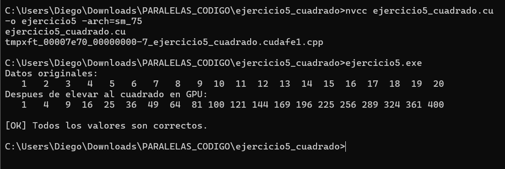
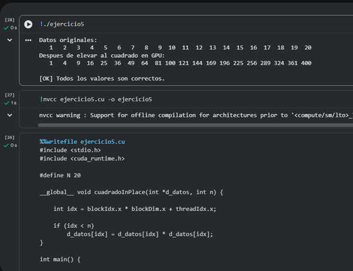

# Ejercicio 5 — Cuadrado de Elementos In-place

**Integrantes:** Brahayan Aldhair Campo Sanchez — Diego Gilberto Rodriguez Portilla

---

## Descripción

Eleva al cuadrado cada elemento de un arreglo de 20 enteros (del 1 al 20) directamente en la GPU, escribiendo el resultado sobre el mismo arreglo (in-place). El kernel `cuadradoInPlace` usa un solo bloque de N hilos (`<<<1, N>>>`). Al recuperar los datos en CPU se verifica que cada posición `i` contenga `(i+1)²`.

---

## Compilación y ejecución

```bash
nvcc ejercicio5_cuadrado.cu -o ejercicio5 -arch=sm_75
ejercicio5.exe
```

---

## Pantallazo — resultado




---

## Diferencias respecto al código base del taller

El taller dejaba como TAREA verificar que cada elemento sea `(i+1)²`. Se agregó el bloque de verificación al final del main:

```c
int ok = 1;
for (int i = 0; i < N; i++) {
    int esperado = (i + 1) * (i + 1);
    if (h_datos[i] != esperado) {
        printf("ERROR en posicion %d\n", i);
        printf("Valor obtenido: %d\n", h_datos[i]);
        printf("Valor esperado: %d\n", esperado);
        ok = 0;
    }
}
if (ok)
    printf("\n[OK] Todos los valores son correctos.\n");
else
    printf("\n[FALLO] Hay errores en los resultados.\n");
```

---

## Preguntas de análisis

**¿Qué significa modificar un arreglo in-place en GPU?**

Significa que el kernel lee y escribe en la misma dirección de memoria en GPU, sin usar un segundo arreglo de salida. Es eficiente en memoria pero requiere que no haya dependencias entre hilos (cada hilo solo lee y escribe su propia posición).

**¿Por qué se usa `<<<1, N>>>`?**

Con N=20 caben todos los hilos en un solo bloque (el límite es 1024). Es la forma más simple de lanzar exactamente N hilos, uno por elemento.

---

## Conceptos practicados

- Modificación in-place de datos en GPU
- Kernel con un solo bloque de N hilos: `<<<1, N>>>`
- Verificación elemento a elemento contra valor esperado `(i+1)²`